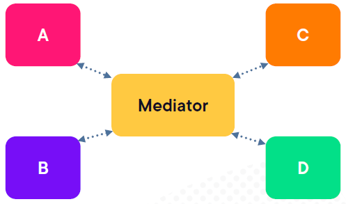

# Emerson.Cargo.DataPipelines

###### Below requirements indicate to implement this solution in .NET vs more established ETL/ELT platforms like Databricks or BigQuery

**Requirement**
###### The task is to merge data from two JSON files containing data reported by IoT devices which capture temperature and humidity data. Each device uses a slightly different JSON schema. Each device uses a slightly different JSON schema.
###### Develop a business layer solution using C# & .NET Core that will process data from each file,
###### Summarize the data in to a single standardized list, and add some calculated values:
* Average temperature of each device
* Average humidity of each device
* Total record count for both temperature and humidity
* First and Last time each device reported sensor values
###### Save the merged list to a new JSON file

**Running Instructions**
###### You can open the solution in Visual Studio 2022. It contains main console project Emerson.Cargo.DataPipelines.Ingest. Main is expecting a path where the output json file will be saved. If no path is provided, it will default to 'output.json' in the current directory. The solution also contains unit tests project Emerson.Cargo.DataPipelines.Tests. You can run the tests from there or from the Test Explorer in Visual Studio. Make sure you have a valid output path, I am using "c:\tmp\output.json" in the below example
###### Another way to run is with dotnet run. First, at the solution level perform a build
* dotnet build .\Emerson.Cargo.DataPipelines.sln
* cd .\Emerson.Cargo.DataPipelines.Ingest\
* dotnet run "C:\tmp\output.json"

**Design**
###### We are going to use hexagonal architecture to simulate real world scenarious where we have many sources with different schemas. This design aims at creating loosely coupled application components that can be easily connected to their software environment by means of ports and adapters. This makes components exchangeable at any level and facilitates test automation

###### We will use the 'clean architecture' flavour of hexagonal architecture. Which for this project will look as below

###### We will also use Mediator design pattern to fascilliate clean separation of concerns and loose coupling between components. MediatR nugget package implements the pattern and will be used in this project. Loosely speaking, this pattern will allow us to plug in other companies later which have different schemas and the application will continue to map to internal Canonical data model as below

# Architectural Diagram

# Minimal Requirements documentation
* Decide on internal canonical representation for sensor data
* Implement JSON DOM parser for Company1 and Company2
* Use hexagonal architecture to implement the solution
* Include unit tests for all components