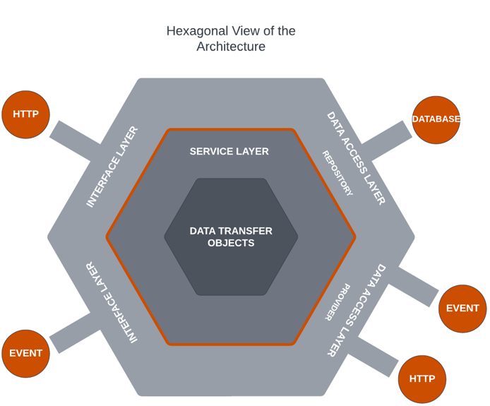
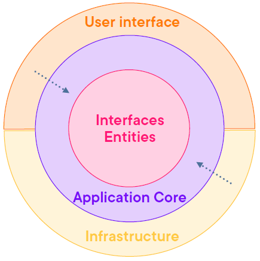
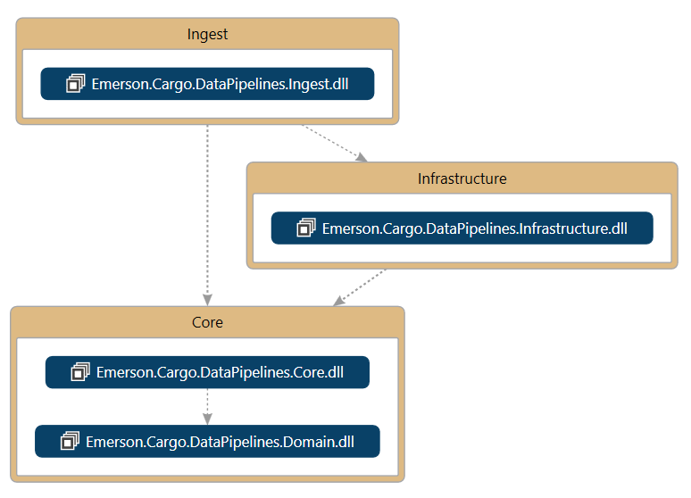

# Emerson.Cargo.DataPipelines

###### Below requirements indicate to implement this solution in .NET vs more established ETL/ELT platforms like Databricks or BigQuery

**Requirement**
###### The task is to merge data from two JSON files containing data reported by IoT devices which capture temperature and humidity data. Each device uses a slightly different JSON schema. Each device uses a slightly different JSON schema.
###### Develop a business layer solution using C# & .NET Core that will process data from each file,
###### Summarize the data in to a single standardized list, and add some calculated values:
* Average temperature of each device
* Average humidity of each device
* Total record count for both temperature and humidity
* First and Last time each device reported sensor values
###### Save the merged list to a new JSON file

**Design**
###### We are going to use hexagonal architecture to simulate real world scenarious where we have many sources with different schemas. This design aims at creating loosely coupled application components that can be easily connected to their software environment by means of ports and adapters. This makes components exchangeable at any level and facilitates test automation

###### We will use the 'clean architecture' flavour of hexagonal architecture. Which for this project will look as below

# Architectural Diagram

# Minimal Requirements documentation
* Decide on internal canonical Tax representation in the system
* Implement central DI strategy
* Implement central cross cutting concerns
* Decide on api auth strategy for different integrations